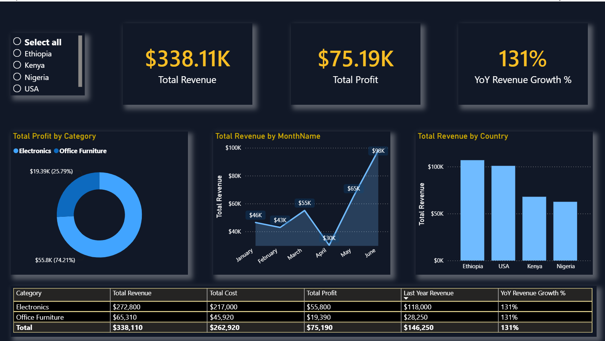

# Global Sales Performance Analytics (Power BI)

## Project Overview
This Power BI dashboard provides an executive-level analysis of global sales revenue and profitability across multiple countries (Ethiopia, Kenya, Nigeria, USA) and product categories (Electronics and Office Furniture). It helps stakeholders track performance trends, profitability margins, and Year-over-Year (YoY) growth.

## Dashboard Preview

## Key Features
* **Executive KPIs:** Real-time visibility into Total Revenue ($338.11K), Total Profit ($75.19K), and an impressive 131% YoY Revenue Growth.
* **Geographical Insights:** Interactive breakdown of revenue by country to identify top-performing regions.
* **Monthly Trends:** Line chart visualization tracking revenue trajectory from January to June.
* **Advanced DAX & Modeling:** Structured data metrics utilizing Time-Intelligence functions for YoY calculations.

## Data Source & Architecture
* **Data Model:** Star Schema with dedicated dimensions for Calendar, Customers, Products, and Sales.
* **Tools Used:** Power BI Desktop, DAX, Power Query.
